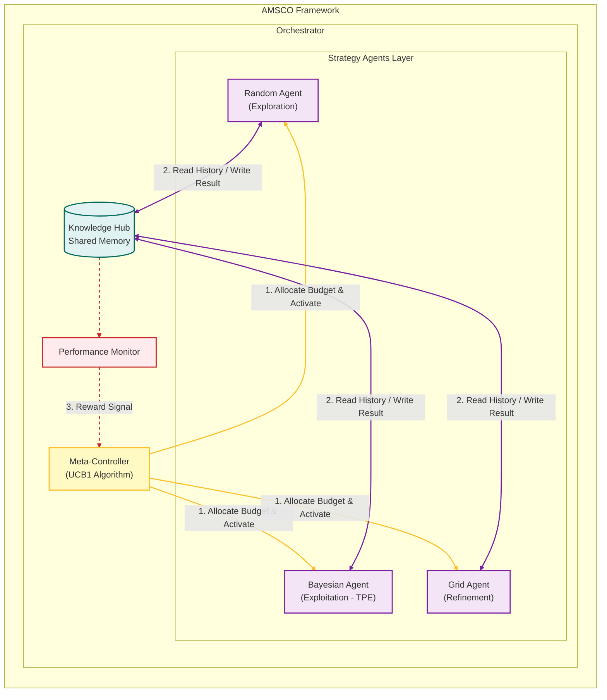

```mermaid
graph TD
    %% Định nghĩa style
    classDef orchestrator fill:#e1f5fe,stroke:#01579b,stroke-width:2px;
    classDef controller fill:#fff9c4,stroke:#fbc02d,stroke-width:2px;
    classDef hub fill:#e0f2f1,stroke:#00695c,stroke-width:2px;
    classDef agent fill:#f3e5f5,stroke:#7b1fa2,stroke-width:2px;
    classDef monitor fill:#ffebee,stroke:#c62828,stroke-width:2px;

    subgraph AMSCO_System [AMSCO Framework]
        direction TB
        
        %% Orchestrator bao trùm
        subgraph Orchestrator_Layer [Orchestrator]
            direction TB
            
            %% Meta Controller
            MC["Meta-Controller<br/>(UCB1 Algorithm)"]:::controller
            
            %% Performance Monitor
            PM[Performance Monitor]:::monitor
            
            %% Agents Layer
            subgraph Strategy_Agents [Strategy Agents Layer]
                direction LR
                RA["Random Agent<br/>(Exploration)"]:::agent
                BA["Bayesian Agent<br/>(Exploitation - TPE)"]:::agent
                GA["Grid Agent<br/>(Refinement)"]:::agent
            end
            
            %% Knowledge Hub
            KH[("Knowledge Hub<br/>Shared Memory")]:::hub
        end
    end

    %% Các luồng tương tác
    
    %% 1. Orchestrator điều phối
    MC -- "1. Allocate Budget & Activate" --> RA
    MC -- "1. Allocate Budget & Activate" --> BA
    MC -- "1. Allocate Budget & Activate" --> GA
    
    %% 2. Agents tương tác với Knowledge Hub
    RA -- "2. Read History / Write Result" <--> KH
    BA -- "2. Read History / Write Result" <--> KH
    GA -- "2. Read History / Write Result" <--> KH
    
    %% 3. Monitor đánh giá
    KH -.-> PM
    PM -- "3. Reward Signal" --> MC
    
    %% Chú thích luồng
    linkStyle 0,1,2 stroke:#fbc02d,stroke-width:2px;
    linkStyle 3,4,5 stroke:#7b1fa2,stroke-width:2px;
    linkStyle 6,7 stroke:#c62828,stroke-width:2px,stroke-dasharray: 5 5;
```